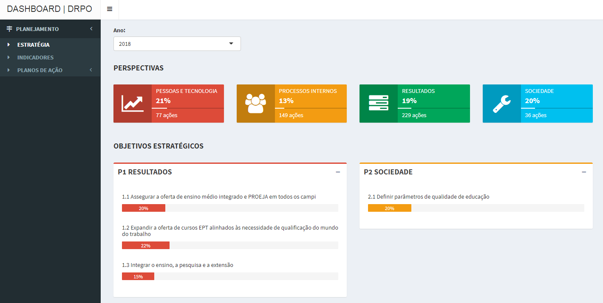
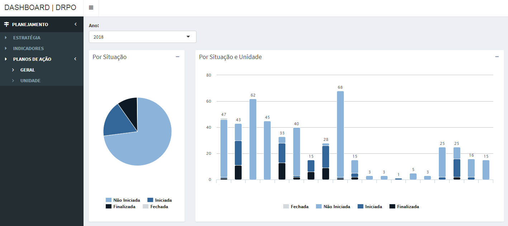
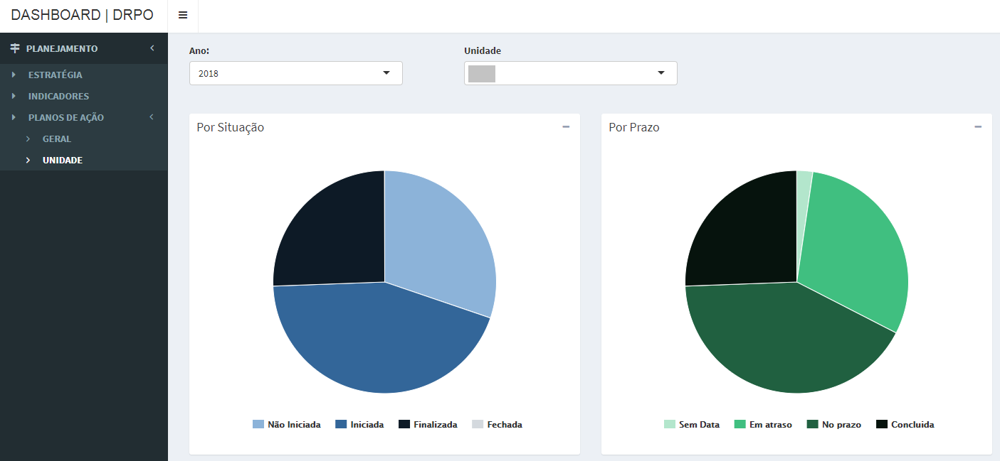
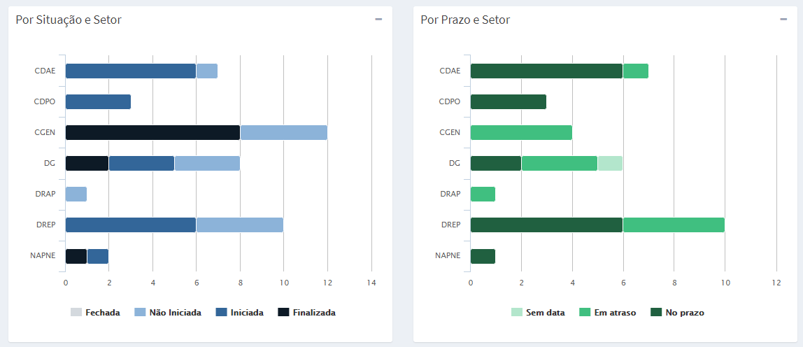

# Dashboard DRPO/IFB

## Objetivos

A dashboard do planejamento e orçamento do Instituto Federal de Educação, Ciência e Tecnologia de Brasília (IFB) tem por objetivo subsdiar os envolvidos no planejamento e orçamento da instituição com informações concisas relacionadas ao planejamento estratégico e orçamentário da instituição.

## Fonte de dados

A plataforma consome dados do Sistema de Gestão Integrado (SGI) - [redmine](https://www.redmine.org/) utilizado pela instituição - e do Tesouro Gerencial, que, por sua vez, tem como fonte o Sistema de Administração Financeira e Orçamentária do IFB.

**Redmine SGI**

O acesso ao banco de dados do SGI é remoto, sendo atualizado ao abrir a aplicação ou ao atualizá-la. O redmine utilizado pela instituição usa o banco de dados MySQL. O acesso ao modo leitura a esse banco é disponibilizado pela Diretoria de Tecnologia da Informação (DTIC) do IFB.

**Tesouro Gerencial**

O tesouro gerencial gera relatório diário de execução orçamentária e financeira e encaminha por correio eletrônico. Os arquivos recebidos são inseridos na plataforma manualmente. 

## Requisitos de acesso

- Acesso à rede interna do IFB;

- Navegadores Google Chrome e Firefox em suas versões mais recentes (testados);

## Desenvolvimento e Manutenção

Pompylio Jerônimo de Lima

Administrador

pompylio.lima@ifb.edu.br

(61) 99800-9995

**Funcionamento**

